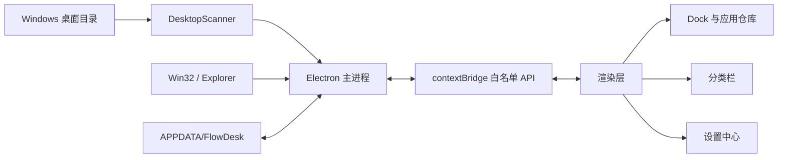

# 灵动桌面 FlowDesk

一个面向 Windows 10/11 的开源桌面整理与美化工具。FlowDesk 会读取用户桌面和公共桌面，将文件、文件夹、快捷方式与应用按类型整理成可展开的分类栏，并提供 Dock、智能推荐、外观材质、动画和布局设置。

[下载安装包](https://github.com/ltr4455/desktop-beautification/releases/download/v0.1.12/Setup.0.1.12.exe) · [版本发布](https://github.com/ltr4455/desktop-beautification/releases) · [问题反馈](https://github.com/ltr4455/desktop-beautification/issues) · [架构文档](docs/ARCHITECTURE.md)

## 当前状态

- 当前版本：`v0.1.12`
- 支持系统：Windows 10 22H2、Windows 11
- 支持架构：x64
- 技术栈：Electron 43、Node.js、原生 HTML/CSS/JavaScript、koffi Win32 FFI
- 开源协议：MIT
- 核心功能离线运行，不上传桌面文件或使用记录

> 项目仍处于早期版本。建议提交 Issue 时附带 Windows 版本、显示缩放比例、复现步骤和截图。

## 功能概览

- 自动扫描用户桌面、公共桌面以及 OneDrive 重定向桌面。
- 自动分类文件夹、图片、文档、音视频、压缩包、网页链接、应用和游戏。
- 应用与游戏统一进入 Dock，并提供应用仓库和搜索。
- 分类栏支持展开、收起、独立居中打开、拖动、隐藏和恢复。
- 按使用次数、最近使用时间和跨天使用情况生成智能推荐。
- 支持毛玻璃、金属、木纹、布纹、星空、极简等外观材质。
- 设置中心包含基础设置、外观材质、交互动效、应用栏、桌面布局、数据管理和关于七个模块。
- 支持硬件加速切换、渲染异常自动回退、全屏应用自动隐藏。
- 支持开机自启动、系统托盘和系统桌面图标显示/隐藏。
- 桌面文件发生新增、修改或删除时自动刷新。
- 安装新版前关闭旧进程并清理旧程序目录，同时保留用户配置。

## 截图

设置中心采用左侧导航和右侧模块化内容布局。项目欢迎贡献新的主题、材质和交互方案。

## 下载与安装

从 [GitHub Releases](https://github.com/ltr4455/desktop-beautification/releases) 下载最新的 NSIS 安装程序：

```text
Setup.0.1.12.exe
```

安装升级流程：

1. 关闭正在运行的旧版 `灵动桌面.exe`。
2. 验证安装目录中同时存在主程序与 `resources/app.asar`。
3. 清理旧版程序目录和旧安装记录。
4. 安装新版程序文件。
5. 保留 `%APPDATA%\FlowDesk` 中的配置、图标缓存和使用记录。

当前版本尚未进行商业代码签名，Windows SmartScreen 或部分杀毒软件可能显示未知发布者提示。请只从本仓库 Releases 页面下载。

## 本地开发

### 环境要求

- Windows 10/11 x64
- Node.js 22 或更高版本
- npm 10 或更高版本
- PowerShell 5.1 或 PowerShell 7

### 安装依赖

```powershell
git clone https://github.com/ltr4455/desktop-beautification.git
cd desktop-beautification
npm install
```

如果 Electron 下载速度较慢：

```powershell
$env:ELECTRON_MIRROR='https://npmmirror.com/mirrors/electron/'
npm install
```

### 运行与检查

```powershell
npm start          # 正常启动
npm run dev        # 开发模式
npm test           # Node 单元测试
npm run smoke      # Electron 渲染、布局和设置持久化冒烟检查
```

### 构建安装包

```powershell
npm run dist:x64
```

安装包输出到 `dist/`。`dist/`、`node_modules/` 和本地用户数据不会提交到 Git。

## 项目结构

```text
desktop-beautification/
├─ assets/                  应用图标
├─ build/
│  └─ installer.nsh        NSIS 覆盖安装与旧版清理逻辑
├─ scripts/
│  ├─ shortcut-info.ps1    解析 Windows 快捷方式
│  ├─ extract-icons.ps1    提取文件和程序图标
│  └─ gen-icon.ps1         生成应用图标
├─ src/
│  ├─ preload.js           安全 IPC 桥，只暴露白名单 API
│  ├─ main/
│  │  ├─ index.js          Electron 生命周期、窗口、托盘、置底与渲染回退
│  │  ├─ ipc.js            主进程 IPC、条目操作、设置和系统能力
│  │  ├─ config.js         配置默认值、迁移与原子写入
│  │  ├─ scanner.js        桌面扫描、监听和图标缓存
│  │  ├─ classifier.js     文件、快捷方式、应用和游戏分类
│  │  ├─ usage.js          使用统计与智能推荐评分
│  │  ├─ paths.js          桌面路径和 OneDrive 重定向解析
│  │  ├─ overlay.js        前台窗口与全屏状态决策
│  │  └─ win32.js          Windows 原生窗口、鼠标和桌面交互
│  └─ renderer/
│     ├─ index.html        Dock、分类栏、仓库、设置中心页面结构
│     ├─ app.js            渲染状态、交互、布局、拖动和设置控制器
│     └─ styles.css        玻璃材质、动画、设置中心和响应式样式
├─ test/                    Node 内置测试运行器测试
├─ docs/ARCHITECTURE.md     架构、数据流、配置和 IPC 说明
├─ CONTRIBUTING.md         贡献流程和编码约定
├─ CHANGELOG.md            版本变更记录
├─ PROJECT_STATE.md        项目维护与交接记录
└─ package.json            依赖、脚本和 electron-builder 配置
```

## 架构概览



详细说明见 [docs/ARCHITECTURE.md](docs/ARCHITECTURE.md)。

## 用户数据与隐私

默认数据目录：

```text
%APPDATA%\FlowDesk\
├─ config.json       设置、布局、隐藏项目与手动添加项目
├─ usage.json        仅记录通过本应用打开项目的使用统计
├─ lnk-cache.json    快捷方式解析缓存
└─ icons/            本地图标缓存
```

FlowDesk 不会上传这些数据。卸载或覆盖安装默认不会删除该目录；如需彻底清除，可退出程序后手动删除。

## 安全边界

- 渲染进程启用 `contextIsolation` 和沙箱，通过 `src/preload.js` 暴露有限 API。
- 不在渲染层直接使用 Node.js 文件系统或执行系统命令。
- 安装器只有在验证主程序和 `app.asar` 同时存在后才清理安装目录。
- 默认不提供文件删除、移动或重命名功能，减少误操作风险。

## 参与贡献

请先阅读 [CONTRIBUTING.md](CONTRIBUTING.md)。欢迎提交：

- Bug 修复和稳定性改进
- Windows 多显示器、DPI 和渲染兼容性改进
- 新材质、新主题和可访问性优化
- 自动化测试与文档完善

## 许可证

本项目采用 [MIT License](LICENSE)。
