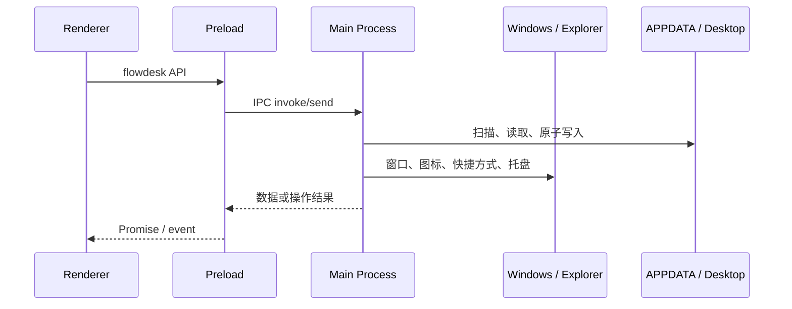

# FlowDesk 架构说明

本文档面向希望理解、维护或二次开发 FlowDesk 的开发者。

## 1. 进程边界

FlowDesk 使用标准 Electron 三层结构：

1. 主进程负责窗口生命周期、系统托盘、Windows 原生调用、文件扫描、配置与安装相关能力。
2. preload 通过 `contextBridge` 暴露经过白名单限制的 `window.flowdesk` API。
3. 渲染进程只负责界面、状态展示和用户交互，不直接访问 Node.js 文件系统。



## 2. 主进程模块

### `src/main/index.js`

- 创建透明、无边框桌面覆盖窗口。
- 管理单实例、托盘菜单、显示器变化、睡眠唤醒和 Explorer 重启。
- 根据前台窗口状态决定正常显示或全屏隐藏。
- 负责 GPU 异常检测与 `--disable-gpu` 回退。
- 注册 IPC 上下文并执行冒烟检查。

### `src/main/ipc.js`

- 汇总扫描结果、手动条目、隐藏状态和智能推荐。
- 打开文件、定位文件、修改分类、手动添加和移除条目。
- 读写设置、容器布局、样式、置顶和使用记录。
- 控制系统桌面图标、鼠标穿透和设置中心专注模式。
- 外部链接只接受明确协议，普通域名补充 `http://`。

### `src/main/scanner.js`

- 扫描用户桌面与公共桌面。
- 使用 `chokidar` 监听新增、修改、删除和目录变化。
- 调用 PowerShell 解析快捷方式与提取图标。
- PowerShell 子进程设置 8 秒超时，避免扫描永久挂起。

### `src/main/classifier.js`

- 根据扩展名、快捷方式目标和应用特征进行分类。
- 游戏识别结果在视觉层与应用合并进入 Dock。
- 支持用户分类覆盖。

### `src/main/config.js`

- 定义设置默认值和配置结构。
- 使用深度合并兼容旧配置缺失字段。
- 使用临时文件加替换方式进行原子写入。
- 配置损坏时回退默认值并保留备份。

### `src/main/usage.js`

- 仅记录通过 FlowDesk 成功打开的项目。
- 根据打开次数、最近使用、近期动量和跨天使用计算推荐分数。
- 隐藏条目在 Top N 排序前排除。

### `src/main/win32.js` 与 `overlay.js`

- 使用 koffi 调用 User32、Shell32 等 Windows API。
- 判断桌面窗口、全屏窗口、鼠标所在顶层窗口和本应用窗口。
- 管理桌面置底、点击穿透和前台窗口策略。
- 原生能力不可用时自动降级，不阻止核心界面运行。

## 3. 渲染层

### 状态模型

`src/renderer/app.js` 内的 `state` 保存：

- 主进程推送的数据快照
- 容器布局、隐藏条目和置顶项目
- 当前展开或独立打开的分类
- Dock 滚动位置与仓库状态
- 设置中心状态和保存状态
- 收起动画、待展开目标与渲染动效令牌

### 分类栏交互

- 点击标题栏：在当前位置展开或收起。
- 拖动标题栏：自由移动；靠近分类轨道时重新吸附。
- 点击独立打开按钮：分类居中显示，再次点击恢复。
- 收起动画期间点击另一个分类：记录 `pendingExpand`，动画结束后展开目标。
- 同一分类在收起过程中的重复点击会被过滤，避免误触重新打开。

### 设置中心

设置中心分为七个模块：

- 基础设置
- 外观材质
- 交互动效
- 应用栏
- 桌面布局
- 数据管理
- 关于

设置修改先更新本地快照，再通过 IPC 持久化。保存失败时回滚快照、刷新控件并显示错误提示。设置中心打开时启用专注模式，主进程暂停鼠标穿透判定，确保真实点击不会落到桌面。

### 渲染层隔离

分类容器不长期使用 `will-change`，动画结束后清理临时合成层。背景材质使用容器独立表面，避免模糊、光效和 transform 造成不同图层采样错位。

## 4. 配置结构

配置默认保存于 `%APPDATA%\FlowDesk\config.json`。

```js
{
  version: 3,
  settings: {
    recommendCount: 8,
    autoStart: false,
    hardwareAcceleration: true,
    dockIconSize: 38,
    dockPosition: 'bottom-center',
    dockOffsetX: 0,
    dockOffsetY: 0,
    dockMagnify: true,
    animEnabled: true,
    animType: 'rise',
    animDuration: 300,
    panelTransitionDuration: 620,
    hoverEffect: true
  },
  containers: {},
  hiddenItems: {},
  pinned: [],
  manualItems: {}
}
```

字段会随版本增加，读取时必须通过默认设置合并，不能假设旧配置包含全部字段。

## 5. IPC 分类

preload 暴露的接口按职责分为：

- 数据：`data`、`refresh`
- 条目：`open`、`reveal`、`setCategory`、`manualAdd`、`manualRemove`
- 布局：`saveContainers`、`saveHidden`、`savePinned`
- 样式：`applyStyle`、`styleAll`
- 设置：`getSettings`、`setSettings`
- 系统：`iconsStatus`、`iconsToggle`、`focusMode`、`mouseover`、`quit`
- 事件：数据更新、图标完成、视口变化、GPU 回退和打开设置

新增 IPC 时必须同时修改主进程处理器和 preload 白名单，不要把任意 IPC 通道直接暴露给渲染层。

## 6. 构建和安装

electron-builder 将应用打包为 x64 NSIS 安装程序。

`build/installer.nsh` 在安装开始时：

1. 强制关闭旧版主进程。
2. 同时检查旧主程序和 `resources/app.asar`。
3. 删除验证过的旧安装目录。
4. 清理旧安装注册表记录，防止安装器再次调用已删除的旧卸载器。
5. 继续安装新版。

用户数据不在安装目录中，因此覆盖安装不会删除 `%APPDATA%\FlowDesk`。

## 7. 测试

测试使用 Node.js 内置测试运行器：

- 分类规则
- 配置目录、迁移、损坏恢复和原子保存
- 桌面路径解析
- 前台窗口覆盖策略
- 智能推荐评分
- IPC URL 规范化和隐藏推荐过滤

`npm run smoke` 会启动 Electron，并检查窗口、布局、Dock、图标加载和设置真实持久化。

## 8. 扩展建议

- 新增设置：先加入 `DEFAULT_SETTINGS`，再增加 UI、绑定和必要测试。
- 新增分类：同步更新分类器、渲染标签、排序和测试。
- 新增原生能力：必须提供不可用时的降级路径。
- 新增动效：动画结束和超时回退都必须清理 class、内联样式与 `will-change`。
